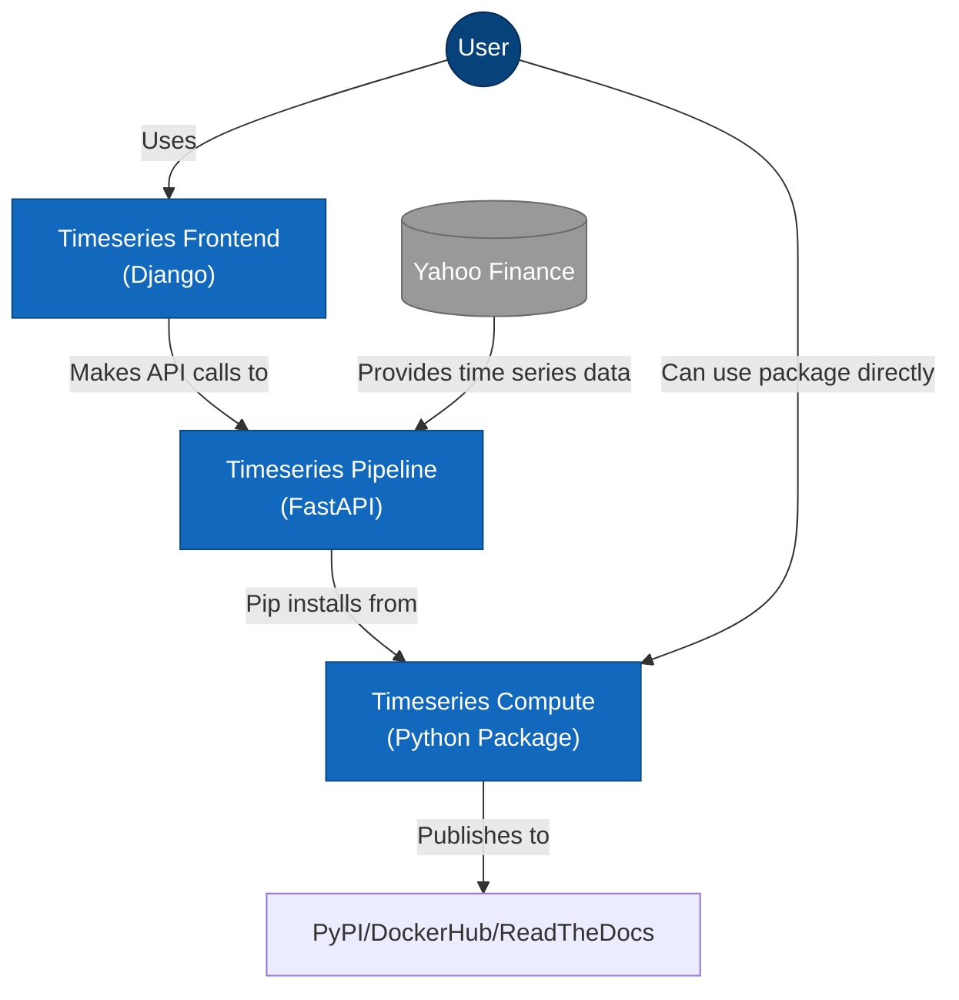

# Timeseries Frontend

## Overview

```ascii
  ████████╗██╗███╗   ███╗███████╗███████╗███████╗██████╗ ██╗███████╗███████╗
  ╚══██╔══╝██║████╗ ████║██╔════╝██╔════╝██╔════╝██╔══██╗██║██╔════╝██╔════╝
     ██║   ██║██╔████╔██║█████╗  ███████╗█████╗  ██████╔╝██║█████╗  ███████╗
     ██║   ██║██║╚██╔╝██║██╔══╝  ╚════██║██╔══╝  ██╔══██╗██║██╔══╝  ╚════██║
     ██║   ██║██║ ╚═╝ ██║███████╗███████║███████╗██║  ██║██║███████╗███████║
     ╚═╝   ╚═╝╚═╝     ╚═╝╚══════╝╚══════╝╚══════╝╚═╝  ╚═╝╚═╝╚══════╝╚══════╝
     ███████╗██████╗  ██████╗ ███╗   ██╗████████╗███████╗███╗   ██╗██████╗
     ██╔════╝██╔══██╗██╔═══██╗████╗  ██║╚══██╔══╝██╔════╝████╗  ██║██╔══██╗
     █████╗  ██████╔╝██║   ██║██╔██╗ ██║   ██║   █████╗  ██╔██╗ ██║██║  ██║
     ██╔══╝  ██╔══██╗██║   ██║██║╚██╗██║   ██║   ██╔══╝  ██║╚██╗██║██║  ██║
     ██║     ██║  ██║╚██████╔╝██║ ╚████║   ██║   ███████╗██║ ╚████║██████╔╝
     ╚═╝     ╚═╝  ╚═╝ ╚═════╝ ╚═╝  ╚═══╝   ╚═╝   ╚══════╝╚═╝  ╚═══╝╚═════╝
```

A Django frontend for modeling time series.

TODO: Add codecov

TODO: Add docker

TODO: Add pytests

TODO: Add multiple price series support.

TODO: add database container

Neon/lime green (#BFFF00) background elements and text fragments
Pink/coral (#FF9E8F)
Black background (#000000)

## Features (Planned)

- User-friendly interface for time series analysis
- Interactive charts with Plotly
- Dropdown selection for different indices
- Display for model statistics and forecasts
- API integration with the backend pipeline
- User authentication and saved analysis

## Integration Overview



## Architecture

- Django REST Framework
- Plotly for visualizations interactive results
- Responsive Bootstrap design
- Django forms for user input, styled as a wizard

## Development Roadmap

1. **Setup Django Project**
   - Initialize Django project structure
   - Configure dev/prod settings
   - Set up Django REST Framework

2. **Create Core Views**
   - Homepage w/intro
   - Analysis w/forms
   - Results w/visualizations

3. **API Integration**
   - Connect to backend API endpoints
   - Handle authentication and data transfer
   - Implement error handling

4. **Dashboard Development**
   - Design interactive dashboard
   - Implement data visualizations
   - Add filtering and customization options

5. **Testing & Deployment**
   - Write unit and integration tests
   - Setup CI/CD with GitHub Actions
   - Configure for prod deployment

6. Check Django API for Beginners, advanced topics for more.

## Getting Started (Future)

```bash
# Clone the repository
git https://github.com/garthmortensen/timeseries-frontend
cd timeseries-frontend

# Create a virtual environment
python -m venv venv
source venv/bin/activate  # On Windows: venv\Scripts\activate

# Install dependencies
pip install -r requirements.txt

# Run migrations
python manage.py migrate

# Start the development server
python manage.py runserver
```

## Deployment

Deploy frontend using:

- Docker containers
- Google Cloud Run
- Nginx for serving static files (is this needed with cloud run?)
- HTTPS with Let's Encrypt (is this needed with cloud run?)

## Integration with Backend

Frontend will communicate with the backend API via:

- RESTful API calls
- JSON data exchange
- JWT tokens authentication

## Design Principles

- Clean, intuitive user interface
- Mobile-responsive design
- Accessible visualization options
- Clear presentation of statistical results
- Efficient API usage to minimize latency

