# Spillover Lab Frontend

## Overview

```ascii
  ███████╗██████╗ ██╗██╗     ██╗      ██████╗ ██╗   ██╗███████╗██████╗ 
  ██╔════╝██╔══██╗██║██║     ██║     ██╔═══██╗██║   ██║██╔════╝██╔══██╗
  ███████╗██████╔╝██║██║     ██║     ██║   ██║██║   ██║█████╗  ██████╔╝
  ╚════██║██╔═══╝ ██║██║     ██║     ██║   ██║╚██╗ ██╔╝██╔══╝  ██╔══██╗
  ███████║██║     ██║███████╗███████╗╚██████╔╝ ╚████╔╝ ███████╗██║  ██║
  ╚══════╝╚═╝     ╚═╝╚══════╝╚══════╝ ╚═════╝   ╚═══╝  ╚══════╝╚═╝  ╚═╝
                           ██╗      █████╗ ██████╗
                           ██║     ██╔══██╗██╔══██╗
                           ██║     ███████║██████╔╝
                           ██║     ██╔══██║██╔══██╗
                           ███████╗██║  ██║██████╔╝
                           ╚══════╝╚═╝  ╚═╝╚═════╝
```                   

A Django frontend for spillover analysis and time series modeling.

Implementation hosted at www.spilloverlab.com.

## TODO:

on first run, i can navigate to 
https://www.spilloverlab.com/results/

- Download API Response works multiple times.
- View API Response only works the first time
- After clicking View API Response once, Download API Response returns "No API response available."
- After clicking View API Response once, clicking View API Response a second time returns "No API response available."
- Provenance tab Export CSV only works the first time. 
- After clicking Provenance tab Export CSV once, clicking Export CSV a second time returns No returns_data data available for export.


## Features


- User-friendly interface for time series analysis
- Interactive charts with Plotly
- Dropdown selection for different indices
- Display for model statistics and forecasts
- API integration with the backend pipeline
- User authentication and saved analysis

## Usage notes


Use 250, 500 obs for ARCH, GARCH. 
> Considering the size of biases and convergence errors, it is proposed that at least 250 observations are needed for ARCH(1) models and 500 observations for GARCH(1,1) models. [Small sample properties of GARCH estimates and persistence](https://www.tandfonline.com/doi/abs/10.1080/13518470500039436)


### Integration Overview


### Additional (C4) Architectural Diagrams

Each level of a C4 diagram provides a different level of zoom. This helps users understand the frontend project at the most-useful granularity.

#### Level 2: Container Diagram

Zooms in to show the major building blocks/"containers". The frontend is a Django web application that serves HTML/CSS/JS to users and communicates with the backend API. It's containerized for deployment and includes a CI/CD pipeline for automated testing.


#### Level 3: Component Diagram

Look inside the Django application to see the key components. We can see the views handling user requests, the API client communicating with the backend, and various utilities for plotting and template processing.


#### Level 4: Code/Class Diagram

Shows the main classes and models involved in the Django frontend, including view classes that handle different pages, the API client for backend communication, and utility classes for data visualization.


## Architecture

- Django REST and GraphQL Framework
- Plotly for visualizations interactive results
- Responsive Bootstrap design
- Django forms for user input, styled as a wizard

## Project Structure

```text
timeseries-frontend/.................
├── manage.py                       # Django management script
├── requirements.txt                # Python dependencies
├── Makefile                        # Development automation tasks
├── README.md                       # Project documentation
├── .env.example                    # Environment variables template
├── design_decisions.md             # Architecture and design rationale
├── config/..........................
│   ├── __init__.py                 # Makes config module importable
│   ├── settings.py                 # Main Django settings entry point
│   ├── urls.py                     # Root URL configuration
│   ├── wsgi.py                     # WSGI application entry point
│   ├── asgi.py                     # ASGI application entry point
│   └── settings/....................
│       ├── __init__.py             # Settings package initializer
│       ├── base.py                 # Common settings for all environments
│       ├── development.py          # Development-specific settings
│       ├── production.py           # Production-specific settings
│       └── security_settings.py    # Security configurations
├── timeseries/......................
│   ├── __init__.py                 # Makes timeseries app importable
│   ├── admin.py                    # Django admin configuration
│   ├── apps.py                     # Django app configuration
│   ├── models.py                   # Database models
│   ├── views.py                    # View controllers
│   ├── urls.py                     # App-specific URL patterns
│   ├── api_client.py               # Backend API communication
│   ├── context_processors.py       # Template context processors
│   ├── plotting_utils.py           # Chart and visualization utilities
│   ├── tests.py                    # Unit tests
│   ├── migrations/                 # Database migration files
│   └── templatetags/               # Custom template tags
├── templates/.......................
│   ├── base.html                   # Base template with common layout
│   └── timeseries/
│       ├── index.html              # Homepage template
│       ├── analysis.html           # Analysis form template
│       ├── results.html            # Results display template
│       ├── about.html              # About page template
│       └── debug_results.html      # Debug information template
├── static/..........................
│   ├── css/
│   │   └── style.css               # Custom CSS styles
│   ├── js/
│   │   └── main.js                 # Custom JavaScript
│   ├── favicon/                    # Favicon files
│   └── images/                     # Static images
├── logs/............................
│   └── app.log                     # Application logs (rotating)
└── stub.github/workflows/...........
    └── cicd.yml                    # CI/CD pipeline configuration
```

## Development Roadmap

1. **Setup Django Project**
   - Initialize Django project structure
   - Configure dev/prod settings
   - Set up Django REST Framework

2. **Create Core Views**
   - Homepage w/intro
   - Analysis w/forms
   - Results w/visualizations

3. **API Integration**
   - Connect to backend API endpoints
   - Handle authentication and data transfer
   - Implement error handling

4. **Dashboard Development**
   - Design interactive dashboard
   - Implement data visualizations
   - Add filtering and customization options

5. **Testing & Deployment**
   - Write unit and integration tests
   - Setup CI/CD with GitHub Actions
   - Configure for prod deployment

## Getting Started

```bash
# Clone the repository
git https://github.com/garthmortensen/timeseries-frontend
cd timeseries-frontend

# Create a virtual environment
python -m venv venv
source venv/bin/activate  # On Windows: venv\Scripts\activate

# Install dependencies
pip install -r requirements.txt

# Run migrations
python manage.py migrate

# Start the development server
python manage.py runserver
```

## Deployment

Deploy frontend using:

- Docker containers
- Google Cloud Run

## Integration with Backend

Frontend communicates with the backend API via:

- RESTful API calls
- JSON data exchange
- JWT tokens authentication

## Design Principles

- Clean, intuitive user interface
- Mobile-responsive design
- Clear presentation of model setup and results
- Simple English guide to model setup and interpretation
- Accessible visualization options
- Efficient API usage to minimize transfers
- Architected using microservices

### Enhanced Spillover Analysis Flow

The spillover analysis process has been significantly enhanced with multi-level significance testing and improved interpretations:

```mermaid
flowchart TD
    %% Styling
    classDef input fill:#E8F4FD,color:#000,stroke:#1E88E5,stroke-width:2px
    classDef process fill:#FFF3E0,color:#000,stroke:#FF9800,stroke-width:2px
    classDef analysis fill:#F3E5F5,color:#000,stroke:#9C27B0,stroke-width:2px
    classDef output fill:#E8F5E8,color:#000,stroke:#4CAF50,stroke-width:2px
    classDef enhanced fill:#FFEBEE,color:#000,stroke:#F44336,stroke-width:3px
    
    %% Input Data
    TimeSeriesData[("Time Series Data<br/>Returns DataFrame")]:::input
    
    %% Data Preparation
    DataValidation["Data Validation<br/>• Check for missing values<br/>• Ensure sufficient observations<br/>• Validate datetime index"]:::process
    
    NumericSelection["Select Numeric Columns<br/>• Filter non-numeric data<br/>• Prepare for VAR modeling"]:::process
    
    %% VAR Model Setup
    LagSelection["Optimal Lag Selection<br/>• Calculate safe max lag<br/>• Use AIC criterion<br/>• Ensure stability"]:::process
    
    VARFitting["VAR Model Fitting<br/>• Fit VAR(p) model<br/>• Validate model stability<br/>• Extract coefficients"]:::analysis
    
    %% Spillover Analysis
    FEVDCalculation["FEVD Calculation<br/>• Forecast Error Variance Decomposition<br/>• Calculate spillover matrix<br/>• Generate directional spillovers"]:::analysis
    
    SpilloverMetrics["Spillover Metrics<br/>• Total Spillover Index<br/>• Directional Spillovers<br/>• Net Spillovers<br/>• Pairwise Spillovers"]:::analysis
    
    %% Enhanced Granger Causality
    GrangerEnhanced["🆕 Enhanced Granger Causality<br/>• Multi-level significance (1%, 5%)<br/>• Optimal lag detection<br/>• Comprehensive p-value analysis<br/>• Robust test statistics"]:::enhanced
    
    %% Results and Interpretations
    SpilloverResults["Spillover Results<br/>• Spillover indices<br/>• FEVD table<br/>• Network effects"]:::output
    
    GrangerResults["🆕 Multi-Level Granger Results<br/>• Highly significant (1% level)<br/>• Significant (5% level)<br/>• Optimal lags per relationship<br/>• Minimum p-values"]:::enhanced
    
    InterpretationEngine["🆕 Enhanced Interpretation Engine<br/>• Business-relevant explanations<br/>• Market context analysis<br/>• Risk assessment insights<br/>• Trading implications"]:::enhanced
    
    %% Final Output
    ComprehensiveReport["Comprehensive Analysis Report<br/>• Spillover analysis<br/>• Causality relationships<br/>• Human-readable interpretations<br/>• Actionable insights"]:::output
    
    %% Flow connections
    TimeSeriesData --> DataValidation
    DataValidation --> NumericSelection
    NumericSelection --> LagSelection
    LagSelection --> VARFitting
    VARFitting --> FEVDCalculation
    VARFitting --> GrangerEnhanced
    FEVDCalculation --> SpilloverMetrics
    SpilloverMetrics --> SpilloverResults
    GrangerEnhanced --> GrangerResults
    SpilloverResults --> InterpretationEngine
    GrangerResults --> InterpretationEngine
    InterpretationEngine --> ComprehensiveReport
```



### Granger Causality Enhancement Details

The enhanced Granger causality testing provides more robust and actionable results:

```mermaid
flowchart LR
    %% Styling
    classDef input fill:#E3F2FD,color:#000,stroke:#2196F3,stroke-width:2px
    classDef test fill:#FFF8E1,color:#000,stroke:#FFC107,stroke-width:2px
    classDef result fill:#E8F5E8,color:#000,stroke:#4CAF50,stroke-width:2px
    classDef enhanced fill:#FFEBEE,color:#000,stroke:#F44336,stroke-width:3px
    
    subgraph "Market Pair Analysis"
        SeriesPair["Market Pair<br/>X → Y"]:::input
    end
    
    subgraph "🆕 Multi-Level Testing"
        Test1pct["1% Significance Test<br/>α = 0.01<br/>High Confidence"]:::enhanced
        Test5pct["5% Significance Test<br/>α = 0.05<br/>Standard Confidence"]:::enhanced
        OptimalLag["Optimal Lag Detection<br/>Best predictive lag<br/>Minimize p-value"]:::enhanced
    end
    
    subgraph "Enhanced Results"
        Result1pct["⭐ Highly Significant<br/>Strong predictive power<br/>Robust relationship"]:::result
        Result5pct["✓ Significant<br/>Meaningful relationship<br/>Standard confidence"]:::result
        ResultNone["✗ No Significance<br/>No predictive power<br/>Independent series"]:::result
    end
    
    subgraph "🆕 Business Interpretation"
        LeadingIndicator["Leading Indicator<br/>X predicts Y movements<br/>Trading opportunity"]:::enhanced
        MarketEfficiency["Market Efficiency<br/>No predictable patterns<br/>Random walk hypothesis"]:::enhanced
        RiskManagement["Risk Management<br/>Contagion effects<br/>Diversification impact"]:::enhanced
    end
    
    %% Connections
    SeriesPair --> Test1pct
    SeriesPair --> Test5pct
    SeriesPair --> OptimalLag
    
    Test1pct --> Result1pct
    Test5pct --> Result5pct
    Test1pct -.-> ResultNone
    Test5pct -.-> ResultNone
    
    Result1pct --> LeadingIndicator
    Result5pct --> LeadingIndicator
    ResultNone --> MarketEfficiency
    Result1pct --> RiskManagement
    Result5pct --> RiskManagement
```



## API Documentation

The frontend communicates with the timeseries-api backend through a comprehensive RESTful API. Here's the complete API reference:

### Base Configuration

```python
# API Client Configuration
API_BASE_URL = "http://localhost:8000"  # Development
API_BASE_URL = "https://api.spilloverlab.com"  # Production
API_TIMEOUT = 30  # seconds
```

### Authentication

Currently using session-based authentication. Future versions will support:
- JWT tokens for stateless authentication
- API keys for programmatic access
- OAuth2 integration for third-party services

### Core API Endpoints

#### 1. Health Check
```http
GET /health
```

**Response:**
```json
{
  "status": "healthy",
  "timestamp": "2025-06-15T10:30:00Z",
  "version": "1.0.0"
}
```

#### 2. Pipeline Execution (Primary Endpoint)
```http
POST /run_pipeline
Content-Type: application/json
```

**Request Body:**
```json
{
  "source_actual_or_synthetic_data": "synthetic",
  "data_start_date": "2023-01-01",
  "data_end_date": "2023-12-31",
  "symbols": ["AAPL", "GOOGL", "MSFT"],
  "synthetic_anchor_prices": [150.0, 2800.0, 300.0],
  "synthetic_random_seed": 42,
  "arima_params": {
    "p": 1,
    "d": 1,
    "q": 1,
    "forecast_steps": 5
  },
  "garch_params": {
    "p": 1,
    "q": 1,
    "dist": "t",
    "forecast_steps": 5
  },
  "scaling_method": "standardize",
  "spillover_enabled": true,
  "spillover_params": {
    "method": "diebold_yilmaz",
    "forecast_horizon": 10,
    "window_size": null,
    "max_lag": 5,
    "alpha": 0.05
  }
}
```

**Response Structure:**
```json
{
  "original_data": [
    {"date": "2023-01-01", "AAPL": 150.0, "GOOGL": 2800.0, "MSFT": 300.0}
  ],
  "returns_data": [
    {"date": "2023-01-02", "AAPL": 0.0153, "GOOGL": -0.0089, "MSFT": 0.0067}
  ],
  "scaled_data": [
    {"date": "2023-01-02", "AAPL": 0.8234, "GOOGL": -0.4567, "MSFT": 0.3421}
  ],
  "stationarity_results": {
    "all_symbols_stationarity": {
      "AAPL": {
        "adf_statistic": -3.45,
        "p_value": 0.032,
        "critical_values": {"1%": -3.75, "5%": -3.0, "10%": -2.63},
        "is_stationary": true,
        "interpretation": "The series is stationary (p-value: 0.0320)."
      }
    }
  },
  "series_stats": {
    "AAPL": {
      "mean": 0.0008,
      "std": 0.0234,
      "skew": -0.1234,
      "kurt": 3.4567,
      "jarque_bera": 12.34,
      "ljung_box": 8.92
    }
  },
  "arima_results": {
    "all_symbols_arima": {
      "AAPL": {
        "summary": "ARIMA(1,1,1) Model Results...",
        "forecast": [0.002, 0.003, 0.0025, 0.0028, 0.0024],
        "interpretation": "The ARIMA model shows an increasing trend..."
      }
    }
  },
  "garch_results": {
    "all_symbols_garch": {
      "AAPL": {
        "summary": "GARCH(1,1) Model Results...",
        "forecast": [0.0025, 0.0028, 0.0030, 0.0027, 0.0029],
        "interpretation": "The GARCH model predicts stable volatility..."
      }
    }
  },
  "spillover_results": {
    "total_spillover_index": 45.67,
    "directional_spillover": {
      "AAPL_to_others": 15.23,
      "GOOGL_to_others": 18.45,
      "MSFT_to_others": 12.99
    },
    "net_spillover": {
      "AAPL": 2.34,
      "GOOGL": -1.23,
      "MSFT": -1.11
    },
    "pairwise_spillover": {
      "AAPL": {"GOOGL": 8.45, "MSFT": 6.78},
      "GOOGL": {"AAPL": 9.12, "MSFT": 9.33},
      "MSFT": {"AAPL": 5.67, "GOOGL": 7.32}
    },
    "granger_causality": {
      "AAPL->GOOGL": {
        "causality_1pct": true,
        "causality_5pct": true,
        "optimal_lag_1pct": 2,
        "optimal_lag_5pct": 2,
        "significance_summary": {
          "min_p_value": 0.0089
        }
      }
    },
    "fevd_table": {
      "AAPL": {"AAPL": 65.2, "GOOGL": 20.3, "MSFT": 14.5},
      "GOOGL": {"AAPL": 18.7, "GOOGL": 58.9, "MSFT": 22.4},
      "MSFT": {"AAPL": 16.1, "GOOGL": 25.6, "MSFT": 58.3}
    },
    "interpretation": "The system shows a total spillover index of 45.67%..."
  },
  "granger_causality_results": {
    "causality_results": {
      "AAPL->GOOGL": {
        "causality_1pct": true,
        "causality_5pct": true,
        "optimal_lag_1pct": 2,
        "optimal_lag_5pct": 2,
        "significance_summary": {"min_p_value": 0.0089}
      }
    },
    "interpretations": {
      "AAPL->GOOGL": "⭐ Highly Significant Causality (1% level): AAPL strongly Granger-causes GOOGL..."
    },
    "metadata": {
      "max_lag": 5,
      "n_pairs_tested": 6,
      "significance_levels": ["1%", "5%"],
      "config_enabled": true
    }
  },
  "var_results": {
    "fitted_model": "VAR model fitted for 3 variables (AAPL, GOOGL, MSFT) as part of spillover analysis",
    "selected_lag": 2,
    "ic_used": "AIC",
    "coefficients": {
      "AAPL": {"lag1_AAPL": 0.123, "lag1_GOOGL": 0.045},
      "GOOGL": {"lag1_AAPL": 0.078, "lag1_GOOGL": 0.156}
    },
    "granger_causality": {
      "AAPL->GOOGL": {"causality_1pct": true}
    },
    "fevd_matrix": [
      [65.2, 20.3, 14.5],
      [18.7, 58.9, 22.4],
      [16.1, 25.6, 58.3]
    ],
    "fevd_interpretation": {
      "AAPL": "For AAPL, forecast errors are explained as follows: 65.2% comes from its own innovations..."
    },
    "interpretation": "The Vector Autoregression (VAR) model has been successfully fitted with 2 lag(s)..."
  }
}
```

### Data Source Options

#### Synthetic Data Parameters
```json
{
  "source_actual_or_synthetic_data": "synthetic",
  "synthetic_anchor_prices": [150.0, 2800.0, 300.0],
  "synthetic_random_seed": 42
}
```

#### Real Market Data Parameters
```json
{
  "source_actual_or_synthetic_data": "actual",
  "symbols": ["AAPL", "GOOGL", "MSFT"],
  "data_start_date": "2023-01-01",
  "data_end_date": "2023-12-31"
}
```

### Model Configuration Options

#### ARIMA Parameters
```json
{
  "arima_params": {
    "p": 1,              // Autoregressive order (0-5)
    "d": 1,              // Differencing order (0-2) 
    "q": 1,              // Moving average order (0-5)
    "forecast_steps": 5   // Number of periods to forecast (1-20)
  }
}
```

#### GARCH Parameters
```json
{
  "garch_params": {
    "p": 1,              // GARCH order (1-3)
    "q": 1,              // ARCH order (1-3)
    "dist": "t",         // Distribution: "normal", "t", "skewt"
    "forecast_steps": 5   // Number of periods to forecast (1-20)
  }
}
```

#### Spillover Analysis Parameters
```json
{
  "spillover_enabled": true,
  "spillover_params": {
    "method": "diebold_yilmaz",    // Analysis method
    "forecast_horizon": 10,         // FEVD forecast horizon (5-20)
    "window_size": null,           // Rolling window (null for full sample)
    "max_lag": 5,                  // Maximum VAR lag order (1-10)
    "alpha": 0.05                  // Significance level (0.01, 0.05, 0.10)
  }
}
```

### Error Handling

The API uses standard HTTP status codes and provides detailed error messages:

#### Client Errors (4xx)
```json
{
  "message": "Validation error: Invalid date format",
  "error_type": "ValidationError",
  "details": {
    "field": "data_start_date",
    "expected_format": "YYYY-MM-DD"
  }
}
```

#### Server Errors (5xx)
```json
{
  "message": "Pipeline failed: Insufficient data points for analysis",
  "error_type": "InsufficientDataError",
  "error_location": "DataProcessor in data_processor.py at line 142"
}
```

### Frontend API Client Implementation

The frontend uses a dedicated API client class for backend communication:

```python
class APIClient:
    """
    Handles all communication with the timeseries-api backend.
    Provides methods for pipeline execution and error handling.
    """
    
    def __init__(self, base_url: str, timeout: int = 30):
        self.base_url = base_url
        self.timeout = timeout
        self.session = requests.Session()
    
    def run_full_pipeline(self, pipeline_params: dict) -> dict:
        """
        Execute the complete time series analysis pipeline.
        
        Args:
            pipeline_params: Dictionary with all pipeline parameters
            
        Returns:
            Complete analysis results including all models and interpretations
            
        Raises:
            APIClientException: For API errors
            APIConnectionError: For connection issues
        """
        return self._make_request("POST", "/run_pipeline", pipeline_params)
    
    def get_health(self) -> dict:
        """Check API health status."""
        return self._make_request("GET", "/health")
    
    def _make_request(self, method: str, endpoint: str, data: dict = None) -> dict:
        """Make HTTP request with error handling."""
        # Implementation details...
```

### Data Validation Rules

The API enforces the following validation rules:

#### Date Parameters
- Format: `YYYY-MM-DD`
- `data_start_date` must be before `data_end_date`
- Maximum date range: 5 years
- Minimum date range: 30 days

#### Symbol Parameters
- Minimum symbols: 1
- Maximum symbols: 10
- Valid formats: Uppercase alphanumeric (e.g., "AAPL", "BTC-USD")

#### Model Parameters
- ARIMA orders: p,q ∈ [0,5], d ∈ [0,2]
- GARCH orders: p,q ∈ [1,3]
- Forecast steps: [1,20]
- Spillover max_lag: [1,10]

### Rate Limiting

API requests are rate-limited to ensure fair usage:

- **Development**: 100 requests per hour
- **Production**: 1000 requests per hour per user
- **Burst limit**: 10 requests per minute

### Response Caching

The frontend implements intelligent caching:

- **Pipeline results**: Cached for 1 hour based on parameter hash
- **Health checks**: Cached for 5 minutes
- **Static analysis**: Cached for 24 hours

### WebSocket Support (Future)

Planned WebSocket endpoints for real-time updates:

```javascript
// Future WebSocket implementation
const ws = new WebSocket('wss://api.spilloverlab.com/ws/pipeline');
ws.onmessage = function(event) {
    const update = JSON.parse(event.data);
    updateProgressBar(update.progress);
    if (update.step_complete) {
        displayStepResults(update.step_name, update.results);
    }
};
```
