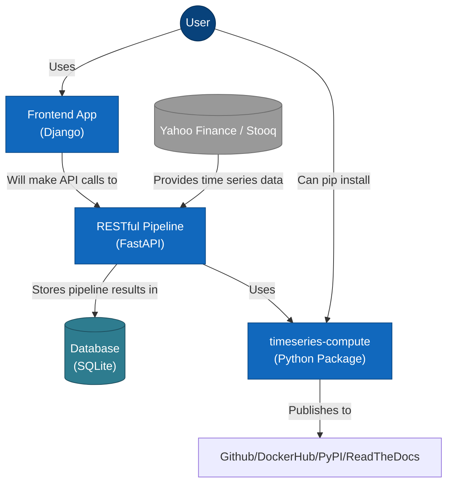

# Spillover Lab Frontend

## Overview

```ascii
  ███████╗██████╗ ██╗██╗     ██╗      ██████╗ ██╗   ██╗███████╗██████╗ 
  ██╔════╝██╔══██╗██║██║     ██║     ██╔═══██╗██║   ██║██╔════╝██╔══██╗
  ███████╗██████╔╝██║██║     ██║     ██║   ██║██║   ██║█████╗  ██████╔╝
  ╚════██║██╔═══╝ ██║██║     ██║     ██║   ██║╚██╗ ██╔╝██╔══╝  ██╔══██╗
  ███████║██║     ██║███████╗███████╗╚██████╔╝ ╚████╔╝ ███████╗██║  ██║
  ╚══════╝╚═╝     ╚═╝╚══════╝╚══════╝ ╚═════╝   ╚═══╝  ╚══════╝╚═╝  ╚═╝
                                                                        
     ██╗      █████╗ ██████╗                                           
     ██║     ██╔══██╗██╔══██╗                                          
     ██║     ███████║██████╔╝                                          
     ██║     ██╔══██║██╔══██╗                                          
     ███████╗██║  ██║██████╔╝                                          
     ╚══════╝╚═╝  ╚═╝╚═════╝                                           
```

A Django frontend for spillover analysis and time series modeling.

## Features (Planned)

- User-friendly interface for time series analysis
- Interactive charts with Plotly
- Dropdown selection for different indices
- Display for model statistics and forecasts
- API integration with the backend pipeline
- User authentication and saved analysis

## Integration Overview



### Additional (C4) Architectural Diagrams

Each level of a C4 diagram provides a different level of zoom. This helps users understand the frontend project at the most-useful granularity.

#### Level 2: Container Diagram

Zooms in to show the major building blocks/"containers". The frontend is a Django web application that serves HTML/CSS/JS to users and communicates with the backend API. It's containerized for deployment and includes a CI/CD pipeline for automated testing.


#### Level 3: Component Diagram

Look inside the Django application to see the key components. We can see the views handling user requests, the API client communicating with the backend, and various utilities for plotting and template processing.


#### Level 4: Code/Class Diagram

Shows the main classes and models involved in the Django frontend, including view classes that handle different pages, the API client for backend communication, and utility classes for data visualization.


## Architecture

- Django REST and GraphQL Framework
- Plotly for visualizations interactive results
- Responsive Bootstrap design
- Django forms for user input, styled as a wizard

## Project Structure

```text
timeseries-frontend/.................
├── manage.py                       # Django management script
├── requirements.txt                # Python dependencies
├── Makefile                        # Development automation tasks
├── README.md                       # Project documentation
├── .env.example                    # Environment variables template
├── design_decisions.md             # Architecture and design rationale
├── config/..........................
│   ├── __init__.py                 # Makes config module importable
│   ├── settings.py                 # Main Django settings entry point
│   ├── urls.py                     # Root URL configuration
│   ├── wsgi.py                     # WSGI application entry point
│   ├── asgi.py                     # ASGI application entry point
│   └── settings/....................
│       ├── __init__.py             # Settings package initializer
│       ├── base.py                 # Common settings for all environments
│       ├── development.py          # Development-specific settings
│       ├── production.py           # Production-specific settings
│       └── security_settings.py    # Security configurations
├── timeseries/......................
│   ├── __init__.py                 # Makes timeseries app importable
│   ├── admin.py                    # Django admin configuration
│   ├── apps.py                     # Django app configuration
│   ├── models.py                   # Database models
│   ├── views.py                    # View controllers
│   ├── urls.py                     # App-specific URL patterns
│   ├── api_client.py               # Backend API communication
│   ├── context_processors.py       # Template context processors
│   ├── plotting_utils.py           # Chart and visualization utilities
│   ├── tests.py                    # Unit tests
│   ├── migrations/                 # Database migration files
│   └── templatetags/               # Custom template tags
├── templates/.......................
│   ├── base.html                   # Base template with common layout
│   └── timeseries/
│       ├── index.html              # Homepage template
│       ├── analysis.html           # Analysis form template
│       ├── results.html            # Results display template
│       ├── about.html              # About page template
│       └── debug_results.html      # Debug information template
├── static/..........................
│   ├── css/
│   │   └── style.css               # Custom CSS styles
│   ├── js/
│   │   └── main.js                 # Custom JavaScript
│   ├── favicon/                    # Favicon files
│   └── images/                     # Static images
├── logs/............................
│   └── app.log                     # Application logs (rotating)
└── stub.github/workflows/...........
    └── cicd.yml            # CI/CD pipeline configuration
```

## Development Roadmap

1. **Setup Django Project**
   - Initialize Django project structure
   - Configure dev/prod settings
   - Set up Django REST Framework

2. **Create Core Views**
   - Homepage w/intro
   - Analysis w/forms
   - Results w/visualizations

3. **API Integration**
   - Connect to backend API endpoints
   - Handle authentication and data transfer
   - Implement error handling

4. **Dashboard Development**
   - Design interactive dashboard
   - Implement data visualizations
   - Add filtering and customization options

5. **Testing & Deployment**
   - Write unit and integration tests
   - Setup CI/CD with GitHub Actions
   - Configure for prod deployment

## Getting Started

```bash
# Clone the repository
git https://github.com/garthmortensen/timeseries-frontend
cd timeseries-frontend

# Create a virtual environment
python -m venv venv
source venv/bin/activate  # On Windows: venv\Scripts\activate

# Install dependencies
pip install -r requirements.txt

# Run migrations
python manage.py migrate

# Start the development server
python manage.py runserver
```

## Deployment

Deploy frontend using:

- Docker containers
- Google Cloud Run

## Integration with Backend

Frontend communicates with the backend API via:

- RESTful API calls
- JSON data exchange
- JWT tokens authentication

## Design Principles

- Clean, intuitive user interface
- Mobile-responsive design
- Clear presentation of model setup and results
- Simple English guide to model setup and interpretation
- Accessible visualization options
- Efficient API usage to minimize transfers
- Architected using microservices 
