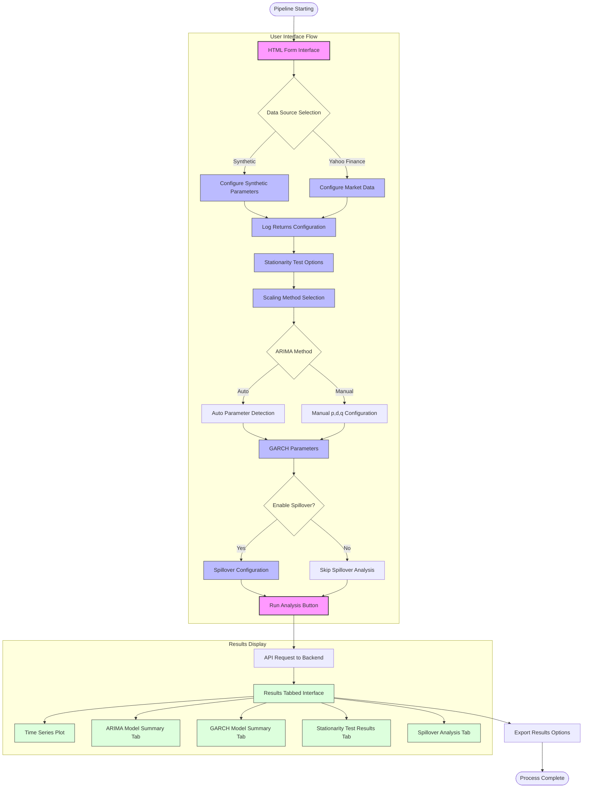

Diagram showing how components connect:

```mermaid
flowchart TD
    Start([Pipeline Starting]) --> Form[HTML Form Interface]
    
    subgraph "User Interface Flow"
        Form --> DataSource{Data Source Selection}
        DataSource -->|Synthetic| GenerateParams[Configure Synthetic Parameters]
        DataSource -->|Yahoo Finance| MarketParams[Configure Market Data]
        
        GenerateParams --> LogReturns[Log Returns Configuration]
        MarketParams --> LogReturns
        
        LogReturns --> Stationarity[Stationarity Test Options]
        Stationarity --> Scaling[Scaling Method Selection]
        
        Scaling --> ARIMAMethod{ARIMA Method}
        ARIMAMethod -->|Auto| AutoARIMA[Auto Parameter Detection]
        ARIMAMethod -->|Manual| ManualARIMA[Manual p,d,q Configuration]
        
        AutoARIMA --> GARCHParams[GARCH Parameters]
        ManualARIMA --> GARCHParams
        
        GARCHParams --> SpilloverEnable{Enable Spillover?}
        SpilloverEnable -->|Yes| SpilloverParams[Spillover Configuration]
        SpilloverEnable -->|No| SkipSpillover[Skip Spillover Analysis]
        
        SpilloverParams --> RunAnalysis[Run Analysis Button]
        SkipSpillover --> RunAnalysis
    end
    
    RunAnalysis --> BackendAPI[API Request to Backend]
    
    subgraph "Results Display"
        BackendAPI --> ResultsTabs[Results Tabbed Interface]
        ResultsTabs --> TimeSeries[Time Series Plot]
        ResultsTabs --> ARIMASummary[ARIMA Model Summary Tab]
        ResultsTabs --> GARCHSummary[GARCH Model Summary Tab]
        ResultsTabs --> StationarityResults[Stationarity Test Results Tab]
        ResultsTabs --> SpilloverResults[Spillover Analysis Tab]
    end
    
    ResultsTabs --> ExportOptions[Export Results Options]
    ExportOptions --> End([Process Complete])
 
    classDef form fill:#f9f,stroke:#333,stroke-width:2px
    classDef process fill:#bbf,stroke:#333,stroke-width:1px
    classDef display fill:#dfd,stroke:#333,stroke-width:1px
    classDef decision fill:#ffd,stroke:#333,stroke-width:1px
    
    class Form,RunAnalysis form
    class GenerateParams,MarketParams,LogReturns,Stationarity,Scaling,GARCHParams,SpilloverParams process
    class ResultsTabs,TimeSeries,ARIMASummary,GARCHSummary,StationarityResults,SpilloverResults display
    class DataSource,ARIMAMethod,SpilloverEnable decision
```
